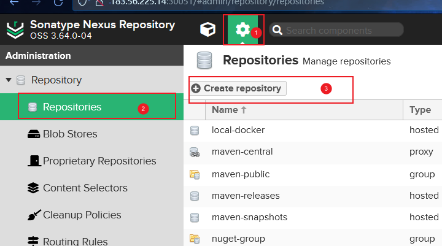
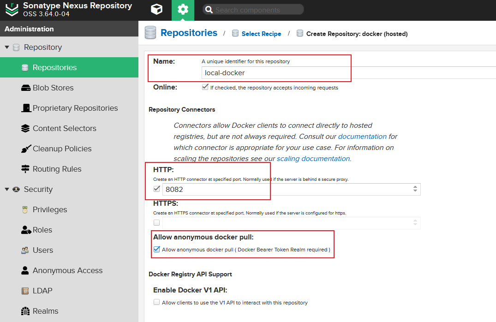
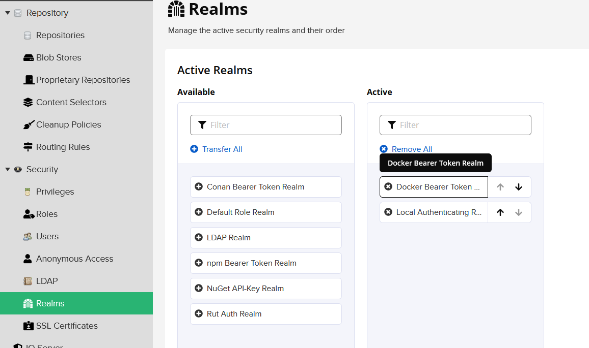
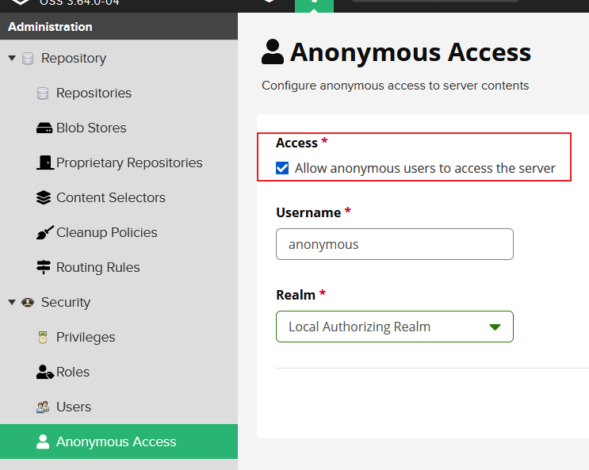

[TOC]

# 搭建私有仓

1. 克隆仓库

    ```bash
    git clone https://github.com/sonatype/docker-nexus3
    ```

2. 进入仓库并编译镜像

    ```
    docker build --rm=true --tag=sonatype/nexus3 .
    ```

3. 编辑`docker-compose.yml`文件，添加`8082`端口映射，并将重启策略(`restart`)设置为`always`

4. 启动服务

    ```bash
    docker compose up -d
    ```

5. 等待服务器启动完成，然后执行以下指令获取默认`admin`登录密码

    ```bash
    docker compose exec nexus cat /nexus-data/admin.password
    ```

6. 在浏览器打开`http://127.0.0.1:8081`，以`admin`登入并修改初始密码

7. 按下图依次点击打开创建存储库界面

    

8. 选择`docker(hosted)`

9. 添加存储库名称, 设置`HTTP`端口为`8082`并勾选允许匿名用户拉取镜像

    

10. 点击最下方的`Create respository`按钮完成创建

11. 激活`Docker Bearer Token Realm`

    

12. 确保允许匿名用户访问服务处于勾选状态

    

# 使用私有仓

1. 编辑`/etc/docker/daemon.json`文件，在`insecure-registries`中添加私有仓地址，如`192.168.1.1:8082`
2. 重启`docker`服务，然后执行`docker info`，确保在`Insecure Registries`中能看到添加的私有仓地址
3. 对于需要发布镜像的服务器，执行`docker login 私有仓地址`，然后输入用户名、密码登入，用户需为有存储库对应权限的`nexus3`用户
4. 发布、拉取镜像时在标签前添加私有仓地址和`/`，如: `192.168.1.1:8082/nginx:1`
